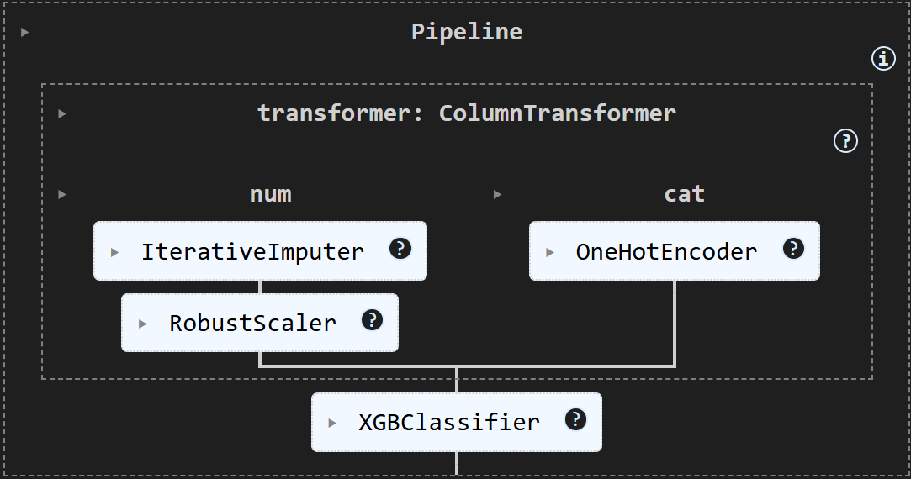
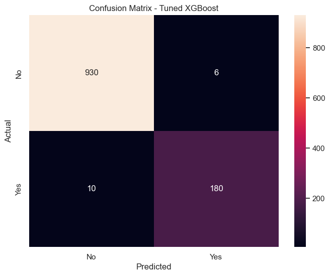
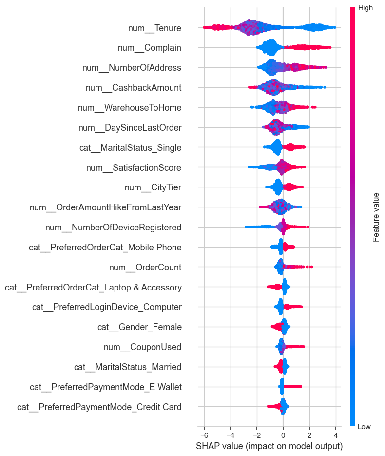
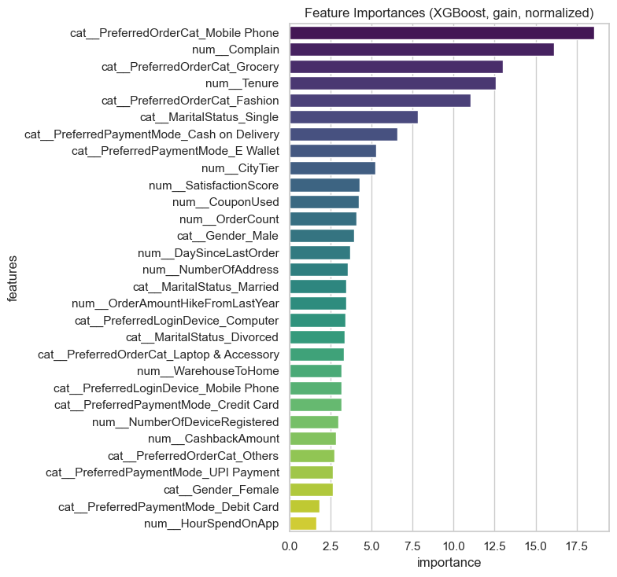
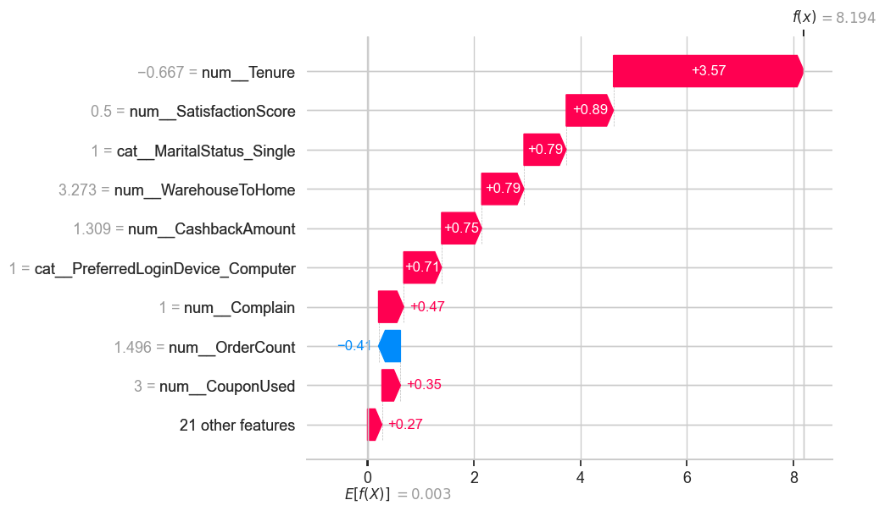
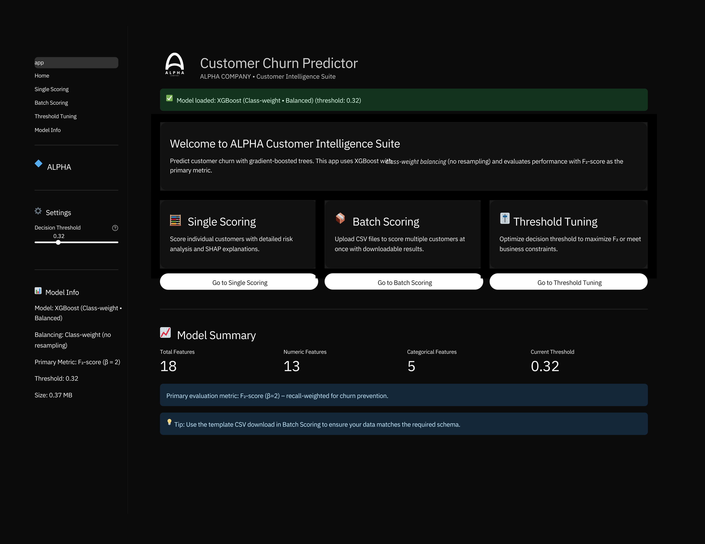
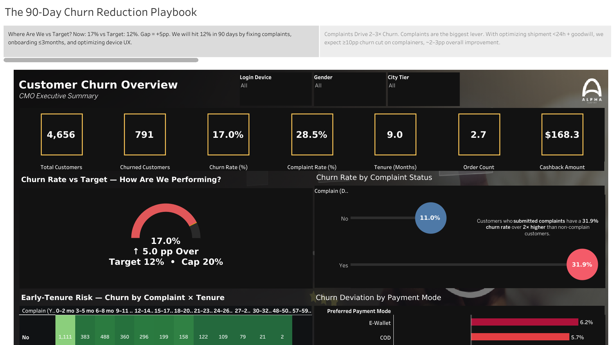

# 🏢 Alpha Company — Customer Churn Prediction

**👨‍💻 Authors:** [Alfriando C. Vean](https://github.com/alfcvean) · [Ardinata Jeremy Kingstone Tambun](https://github.com/ardinatatambun) · [Bonifasius Sinurat](https://github.com/bonifasiusx)

📅 *Purwadhika Final Project — JCDS-3004*

---

## 🎯 1. Business Objective

Alpha Company is a mid-scale e-commerce facing a **critical churn problem** — customers stop transacting or move to competitors.

This project aims to **predict and prevent churn** by:

* 🔍 Identifying **high-risk customers** before they leave
* 🎯 Enabling **targeted & cost-efficient retention** campaigns
* 💰 Delivering **measurable financial impact** and ROI improvements

---

## 📊 2. Data Overview

* **Source:** `E Commerce Dataset.xlsx`
* **Target Variable:** `Churn` (binary: 1 = churned, 0 = active)
* **Sample Size:** 4,656 customers (after cleaning & imputations)
* **Key Features:** `Tenure`, `Complain`, `DaySinceLastOrder`, `PreferredPaymentMode`, `PreferredLoginDevice`, `CityTier`, `SatisfactionScore`, `NumberOfAddress`, `CashbackAmount`, etc.
* **Note:** Data is anonymized for analytics and modeling.

---

## ⚙️ 3. Methodology

| Step                     | Description                                                                                                                                           |
| ------------------------ | ----------------------------------------------------------------------------------------------------------------------------------------------------- |
| **Preprocessing**  | Missing-value imputation (**IterativeImputer** ), scaling ( **RobustScaler** ),**One-Hot Encoding**with `handle_unknown="ignore"` |
| **Modeling**       | **XGBoost (class-weight balanced)** ; no resampling;`scale_pos_weight`computed from train                                                     |
| **Validation**     | 5-Fold CV (with randomized tuning) on**train-only**using**F₂-score**as primary metric;**threshold tuned via CV (train-only)**      |
| **Final Test**     | **Single holdout evaluation once**(no peeking) after model + threshold are frozen                                                               |
| **Explainability** | **SHAP**(global summary, dependence, local waterfall)                                                                                           |
| **Business Layer** | ROI simulation with**CAC–CRC**unit economics                                                                                                   |

### 🧠 Pipeline Overview



---

## 📈 4. Model Performance

**Final Model:** XGBoost (Class-Weighted), threshold from train-CV

|          **Metric** | **Cross-Validation (Nested)** | **Test Set (Final)** |
| ------------------------: | :---------------------------------: | :------------------------: |
|       **F₂-Score** |       ~**0.88 ± 0.02**       |      **0.9677**      |
|     **AUC-PR (AP)** |                 —                 |      **0.9948**      |
|    **Recall (Pos)** |                 —                 |      **0.9789**      |
| **Precision (Pos)** |                 —                 |      **0.9254**      |

**Confusion Matrix (Test Set)**

 **TN=930**,  **FP=6** ,  **FN=10** , **TP=180**



> Notes: Final metrics are computed **once** on holdout; threshold selected via **train-only CV** to avoid test leakage.

---

## 🧩 5. Explainability — SHAP & Feature Importance

### 🔝 Key Drivers of Churn (Model Insights)

1. **Tenure** — shorter tenure sharply increases churn likelihood
2. **Complain** — complaint history ≈ **2–3×** higher churn odds
3. **NumberOfAddress** — more addresses often correlate with unstable usage patterns
4. **CashbackAmount** — lower cashback is associated with higher churn risk
5. **WarehouseToHome** & **DaySinceLastOrder** — distance & recency amplify risk

   *(Categorical signals like  **PreferredOrderCat (Mobile Phone)** ,  **Payment Mode (COD/E-Wallet)** ,  **Device** , **MaritalStatus** also contribute meaningfully.)*

### 🔍 SHAP Global Summary



### 💡 Feature Importances (Model Perspective)



### 📊 Example — Local SHAP Waterfall (Churn Case)



---

## 💵 6. Business Impact & ROI

**Assumptions**

| Parameter                     | Value ($) | Description                                               |
| ----------------------------- | --------: | --------------------------------------------------------- |
| **CAC**                 |        80 | Cost to acquire new customer                              |
| **CRC**                 |        20 | Cost to retain one customer                               |
| **Net Retention Value** |        60 | Savings per successfully retained customer (= CAC − CRC) |

**Impact (Holdout Test — using the final confusion matrix)**

| Component                  |        Value ($) | Notes                                                                                                                                                |
| -------------------------- | ---------------: | ---------------------------------------------------------------------------------------------------------------------------------------------------- |
| **Savings (TP)**     | **11,160** | 186 × (80 − 20)                                                                                                                                    |
| **Cost (FP)**        |    **300** | 15 × 20                                                                                                                                             |
| **Loss (FN)**        |    **320** | 4 × 80                                                                                                                                              |
| **Net Impact**       | **10,540** | 11,160 − (300 + 320)                                                                                                                                |
| **ROI (def.)**       | **36.2×** | ($(\text{Savings} - \text{Cost})/\text{Cost}$) where Cost = FP×CRC                                                                                |
| **ROI_total (alt.)** | **1.78×** | Using full retention budget as denominator: ($(\text{Savings} - (\text{TP}+\text{FP})\times\text{CRC}) / ((\text{TP}+\text{FP})\times\text{CRC})$) |

**Churn ↓ 5pp Scenario (17% → 12%)** — keep recall & FPR unchanged, same population (1,126):

* TP’ ≈  **132** , FP’ ≈  **16** , FN’ ≈  **3** , TN’ ≈ **975**
* **Savings’ = $7,920** ,  **Cost’ = $320** , **Loss’ = $240**
* **Net Impact’ = $7,360** ,  **ROI’ = 23.8×** , **ROI_total’ = 1.68×**

✅ **Takeaway:** precision retention remains **high-ROI** even as churn shrinks; budget is focused on true churners.

---

## 🚀 7. Deployment & Operations

📍 **Live App:** [Visit Alpha Churn Predictor](https://alpha-churn-predictor.streamlit.app/)



**Notes for Ops**

* Artifact: `Streamlit/artifacts/xgb_churn_cw.sav` includes **pipeline + tuned threshold**
* Streamlit pages: Single & batch scoring, threshold tuning, model info
* Add-on dep: `graphviz` for model info page visuals

---

## 📊 8. Tableau Story — *The 90-Day Churn Reduction Playbook*

📍 **Interactive Dashboards:** [Visit Alpha Churn Reduction Playbook](https://public.tableau.com/views/alpha_churn_dashboards/The90-DayChurnReductionPlaybook?:language=en-US&:sid=&:redirect=auth&:display_count=n&:origin=viz_share_link)



---

## 🧱 9. Repository Structure

```
Final Project/
├─ Dataset/
│  ├─ Cleaned Dataset Analysis/       # cleaned after EDA
│  ├─ Processed Data/                 # final train/test CSVs
│  └─ Raw Dataset/                    # original input
├─ images/                            # PNGs for README
├─ Streamlit/                         # Streamlit app (UI & serving)
│  ├─ .streamlit/                     # config.toml, secrets.toml
│  ├─ artifacts/                      # xgb_churn_cw.sav (pipeline + threshold)
│  ├─ assets/                         # css, icons, small UI images
│  ├─ pages/                          # multipage Streamlit
│  ├─ utils/                          # I/O, metrics, plotting, loaders
│  ├─ app.py 
│  └─ requirements.txt
├─ alpha_churn_notebook.ipynb
├─ experimental_notebook.ipynb
└─ README.md
```

---

## 🧪 10. Reproducibility & Environment

**Python:** ≥ 3.10

**Core Packages:** `xgboost`, `lightgbm`, `scikit-learn`, `imbalanced-learn`, `shap`, `pandas`, `numpy`, `matplotlib`, `streamlit`, `graphviz`

### Setup

```bash
pip install -r Streamlit/requirements.txt
```

### Run Notebook

```bash
jupyter notebook alpha_churn_notebook.ipynb
```

### Run Streamlit App

```bash
streamlit run Streamlit/app.py
```

> Ensure artifact & encoder paths are correct, and that **threshold** is read from the `.sav` (session-state default uses it).

---

## 🔍 11. Monitoring & Risks

* **Data Drift:** Track key distributions (e.g., `Tenure`, `DaySinceLastOrder`, `Payment/Device`)
* **Threshold Health:** Revisit decision threshold when churn base rate shifts
* **Calibration:** Periodic probability calibration (reliability curve) if required
* **Feature Availability:** Input schema must match training schema
* **Fair Use:** Guard against unintended bias across segments

---

## 🪪 12. License & Credits

**License:** MIT License © 2025 Group Alpha

**Contributors:**

👤 Alfriando C. Vean · 👤 Ardinata Jeremy Kingstone Tambun · 👤 Bonifasius Sinurat

---

💡 *“Data-driven retention — empowering businesses to act before customers leave.”*
