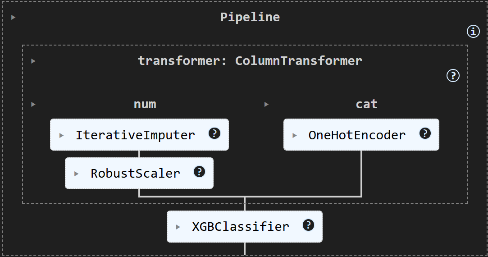
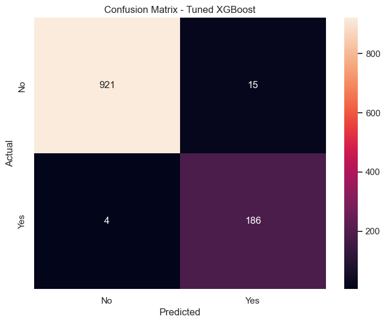
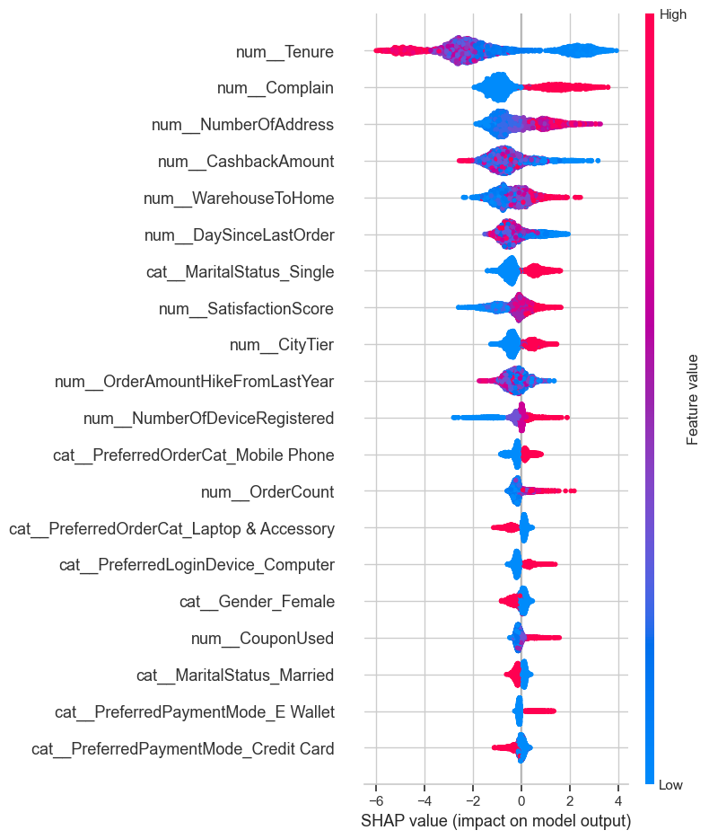
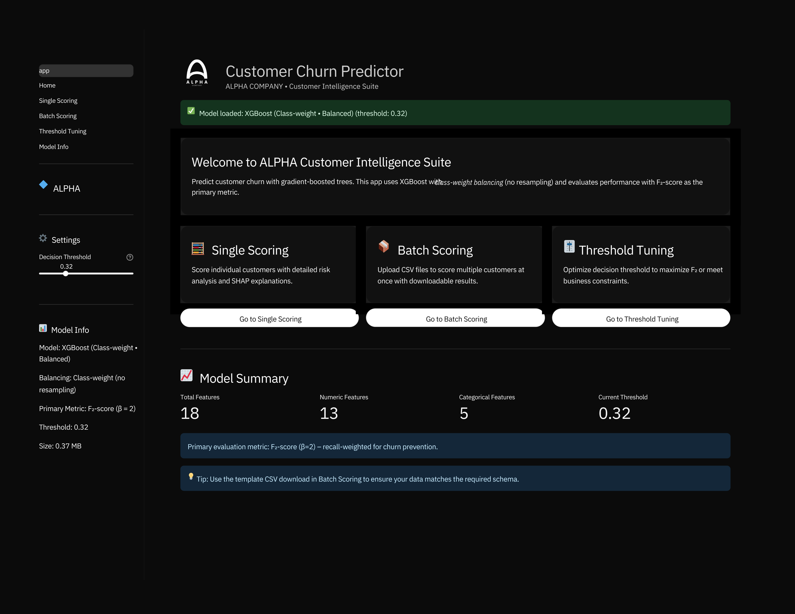
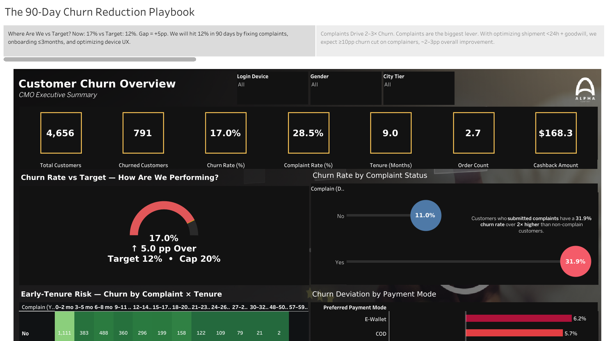

# 🏢 Alpha Company — Customer Churn Prediction

**Authors:** [Alfriando C. Vean](https://github.com/alfcvean) · [Ardinata Jeremy Kingstone Tambun](https://github.com/ardinatatambun) · [Bonifasius Sinurat](https://github.com/bonifasiusx)

*Purwadhika Final Project — JCDS-3004*

---

## 1. Business Objective

Alpha Company (mid-scale e-commerce) faces a **churn problem** where customers stop transacting or move to competitors.

This project aims to **predict churn early** and enable **targeted retention** by:

- Identifying **high-risk customers** before they leave
- Supporting **cost-efficient retention campaigns**
- Translating model outputs into **measurable ROI impact**

---

## 2. Data Overview

- **Source:** `E Commerce Dataset.xlsx`
- **Target:** `Churn` (binary: 1 = churned, 0 = active)
- **Sample size:** **4,656 customers** (after cleaning & imputations)
- **Key features:** `Tenure`, `Complain`, `DaySinceLastOrder`, `PreferredPaymentMode`, `PreferredLoginDevice`, `CityTier`, `SatisfactionScore`, `NumberOfAddress`, `CashbackAmount`, etc.
- **Note:** Data is anonymized for analytics and modeling

---

## 3. Methodology

| Step                     | Description                                                                                                                                          |
| ------------------------ | ---------------------------------------------------------------------------------------------------------------------------------------------------- |
| **Preprocessing**  | Missing-value imputation (**IterativeImputer**), scaling (**RobustScaler**), **One-Hot Encoding** with `handle_unknown="ignore"` |
| **Modeling**       | **XGBoost (class-weight balanced)**; no resampling; `scale_pos_weight` computed from train only                                              |
| **Validation**     | **Nested CV** (outer loop for unbiased estimate; inner loop for tuning) using **F₂-score**; **threshold tuned on train-only CV**  |
| **Final Test**     | **Single holdout evaluation once** after model + threshold are frozen                                                                          |
| **Explainability** | **SHAP** (global + local)                                                                                                                      |
| **Business Layer** | ROI simulation using**CAC–CRC** unit economics                                                                                                |

### Pipeline Overview



---

## 4. Model Performance

**Final model:** XGBoost (Class-Weighted), **threshold selected via train-only CV**

### 4.1 Test Set (Final Holdout)

- **F₂-score:** **0.9677**
- **AUC-PR (AP):** **0.9948**
- **Precision (Churn=1):** **0.9254**
- **Recall (Churn=1):** **0.9789**
- **Accuracy:** **0.9831**

**Confusion Matrix (Test Set)**
**TN=921, FP=15, FN=4, TP=186**



> Notes: test metrics are computed **once** on holdout; hyperparameter tuning + threshold selection are **train-only** to avoid leakage.

### 4.2 Cross-Validation (Nested)

- **F₂-score (mean ± std):** ~**0.88 ± 0.02**

---

## 5. Explainability — SHAP & Feature Importance

### Key Drivers of Churn (Model Insights)

1. **Tenure** — shorter tenure sharply increases churn likelihood
2. **Complain** — complaint history ≈ **2–3×** higher churn odds
3. **NumberOfAddress** — more addresses correlate with unstable usage patterns
4. **CashbackAmount** — lower cashback associated with higher churn risk
5. **WarehouseToHome** & **DaySinceLastOrder** — distance & recency amplify risk

*(Categorical signals like **PreferredOrderCat (Mobile Phone)**, **Payment Mode (COD/E-Wallet)**, **Device**, **MaritalStatus** also contribute meaningfully.)*



---

## 6. Business Impact & ROI

### Assumptions

| Parameter                     | Value ($) | Description                                              |
| ----------------------------- | --------: | -------------------------------------------------------- |
| **CAC**                 |        80 | cost to acquire one new customer                         |
| **CRC**                 |        20 | cost to retain one customer                              |
| **Net retention value** |        60 | savings per successfully retained churner (= CAC − CRC) |

**Final holdout confusion matrix:** **TN=921, FP=15, FN=4, TP=186**
**Actual churn rate (test):** 190 / 1,126 ≈ **16.9%**

### Financial Impact (Based on Holdout)

| Component              | Formula                  | Count | Financial Impact ($) | Interpretation                             |
| ---------------------- | ------------------------ | ----: | -------------------: | ------------------------------------------ |
| **Savings (TP)** | TP × (CAC − CRC)       |   186 |     **11,160** | true churners targeted & assumed retained  |
| **Cost (FP)**    | FP × CRC                |    15 |        **300** | retention cost wasted on non-churners      |
| **Loss (FN)**    | FN × CAC                |     4 |        **320** | missed churners assumed need reacquisition |
| **Net Impact**   | Savings − (Cost + Loss) |    — |     **10,540** | net economic benefit on holdout            |

**Retention budget reference:** targets **TP+FP = 201** customers → budget = 201 × 20 = **$4,020**

### ROI Definitions

**ROI (intervention-only cost, FP-based):**

$$
ROI=\frac{\text{Savings}-\text{Cost}}{\text{Cost}},\quad \text{Cost}=FP\times CRC
$$

- **ROI:**

$$
\frac{(11{,}160-300)}{300}=36.2\times
$$

**ROI_total (budget-based, TP+FP):**

$$
ROI_{\text{total}}=\frac{(\text{Savings}-(TP+FP)\times CRC)}{(TP+FP)\times CRC}
=\frac{(11{,}160-4{,}020)}{4{,}020}=1.78\times
$$

### Scenario: Churn Reduced by 5pp (17% → 12%)

Assume **Recall** and **FPR** stay constant, population = 1,126 ⇒ actual positives ≈ 135, negatives ≈ 991.

- TP’ ≈ **132**, FP’ ≈ **16**, FN’ ≈ **3**, TN’ ≈ **975**
- Savings’ = 132 × 60 = **$7,920**
- Cost’ = 16 × 20 = **$320**
- Loss’ = 3 × 80 = **$240**
- Net Impact’ = **$7,360**
- ROI’ = (7,920 − 320) / 320 = **23.8×**
- ROI_total’ = (7,920 − 2,960) / 2,960 = **1.68×**

**Takeaway:** precision retention remains **high-ROI** even as churn decreases, because spend is focused on true churners.

---

## 7. Deployment & Operations

**Live app (Streamlit):**
[Visit Alpha Churn Predictor](https://alpha-churn-predictor.streamlit.app/)



**Ops Notes**

- Artifacts include **pipeline + tuned threshold**
- Streamlit supports single & batch scoring + threshold info
- Add-on: `graphviz` for model visuals

---

## 8. Tableau Story — The 90-Day Churn Reduction Playbook

**Interactive dashboards:**
[Visit Alpha Churn Reduction Playbook](https://public.tableau.com/views/alpha_churn_dashboards/The90-DayChurnReductionPlaybook?:language=en-US&:sid=&:redirect=auth&:display_count=n&:origin=viz_share_link)



---

## 9. Repository Structure

```text
Final Project/
├─ Dataset/
│  ├─ Cleaned Dataset Analysis/
│  ├─ Processed Data/
│  └─ Raw Dataset/
├─ images/
├─ Streamlit/
│  ├─ .streamlit/
│  ├─ artifacts/
│  ├─ assets/
│  ├─ pages/
│  ├─ utils/
│  ├─ app.py
│  └─ requirements.txt
├─ alpha_churn_notebook.ipynb
├─ experimental_notebook.ipynb
└─ README.md
```
